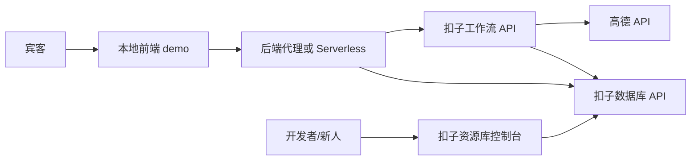
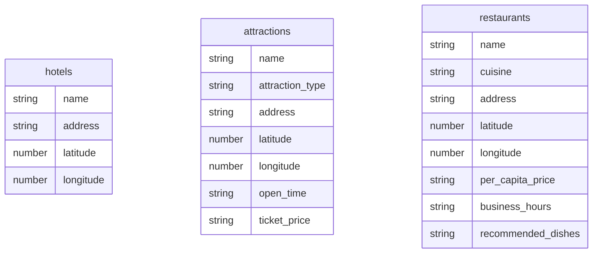

## 架构结论（已修正）

**不在扣子开发宾客 Bot。** 本地已有 React/Vite 前端 demo（GitHub 部署），扣子只提供：

1. **数据库**：`hotels` / `attractions` / `restaurants` 事实存储与新人维护
2. **工作流**：查库、调高德、行程校验等可复用后端逻辑



注意：Vite 静态前端不能直接持有扣子 PAT / 高德 Key，必须经后端代理。

---

## 创建前须知

### 扣子数据库限制

1. 字段类型仅 String / Integer / Time / Number / Boolean
2. 不支持多表 Join；单场婚礼不加 `wedding_code`
3. 系统字段：`id`、`sys_platform`、`uuid`、`bstudio_create_time` 勿重复创建
4. 距离与耗时不落库，运行时用高德计算

### 设计原则

- 库内只存稳定事实
- LLM 判断（老人/雨天/是否来得及）可在本地助手或工作流大模型节点完成
- 高德负责路程与导航参数

### 表结构（已落地）



**进度**：三张表均已创建。

---

## 智能体 vs 工作流（针对本项目）

| 能力 | 是否需要 | 说明 |
|---|---|---|
| 公开宾客智能体 | 否 | 对话入口在本地前端 |
| 工作流 | 是 | 作为可 API 调用的后端流程 |
| 数据库 | 是 | 新人维护地点事实 |
| 壳智能体/应用 | 按需 | 优先只传资源库 workflow_id；若含数据库节点的 API 报错再补空壳 bot_id |

结论：**用工作流，不用把 Bot 当产品入口。** 当前策略：直接调用资源库 workflow；联调失败再补挂载智能体。

---

## 本地如何调用扣子

### 1. 鉴权

1. 扣子开放平台创建个人访问令牌（PAT）
2. 开通权限至少包括：
   - `Database.readRecord`（查询）
   - `Database.writeRecord`（若新人维护也走 API）
   - `run`（执行工作流）
3. Token 只放服务端环境变量，不进前端仓库

### 2. 查数据库 API

```http
POST https://api.coze.cn/v1/databases/:database_id/records/query
Authorization: Bearer <PAT>
```

用途：地图打点、列表展示、简单筛选。  
`database_id` 在各表详情/URL 中获取，分别对应 hotels / attractions / restaurants。

### 3. 执行工作流 API

```http
POST https://api.coze.cn/v1/workflow/run
Authorization: Bearer <PAT>
Content-Type: application/json

{
  "workflow_id": "<工作流ID>",
  "parameters": {
    "available_minutes": 120,
    "party_type": "elderly",
    "transport": "car",
    "start_from": "hotel"
  }
}
```

用途：复杂行程规划（查库 + 高德 + 校验返回时间）。  
工作流需先发布；若接口要求 `bot_id`/`app_id`，填空壳挂载 ID。

### 4. 与本地 demo 的衔接点

现有预留位：

- [`src/data/poiProvider.js`](src/data/poiProvider.js)：`loadSelectedPois` / `searchNearbyPois`
- [`src/data/places.js`](src/data/places.js)：统一点位模型
- [`src/components/WeddingMap.jsx`](src/components/WeddingMap.jsx)：地图展示

建议映射：

1. 启动时调 Coze DB 拉 hotels/attractions/restaurants → 转成 `createPlace` 模型 → 上地图
2. 「帮我规划」按钮调 Coze 工作流 → 展示时间表与各段耗时
3. 导航仍可用现有 `buildAmapNavigationUrl`

---

## 扣子侧下一步（只做这些）

### A. 录入种子数据

在资源库三张表各录几条真实/测试记录（至少 1 酒店、2 景点、2 餐厅）。

### B. 创建工作流（推荐 2 个）

1. `wf_list_places` — **已完成并发布**  
   - `workflow_id = 7671226620824371235`  
   - 输入：`place_type`（hotel/attraction/restaurant）  
   - 试运行三类均返回数据

2. `wf_plan_itinerary` — **待创建**  
   输入：可用分钟数、同行类型、交通方式、出发类型（hotel/venue）  
   节点：查酒店与候选点 → 高德算路 → 校验缓冲时间 → 输出行程 JSON

### C. 发布与拿 ID

- `wf_list_places` 已发布：`7671226620824371235`（优先仅用 workflow_id 调用）
- 仍需记录：PAT；`bot_id` 仅在 API 报错需要关联智能体时再补
- `wf_plan_itinerary` 待发布

### D. 本地联调

- 加一层最小后端/Serverless 代理 Coze API
- 前端改 `poiProvider.js` 调代理，不再读死数据

---

## 关键取舍

- **不做扣子宾客 Bot**：避免双入口，产品在本地
- **工作流可 API 化**：复杂逻辑集中在扣子，前端只消费结果
- **简单列表可直查 DB**：少绕一层工作流
- **Token 必须后端化**：GitHub Pages 静态站不能安全直连扣子
- **极简事实表 + 高德动态路程**：降低新人维护成本
