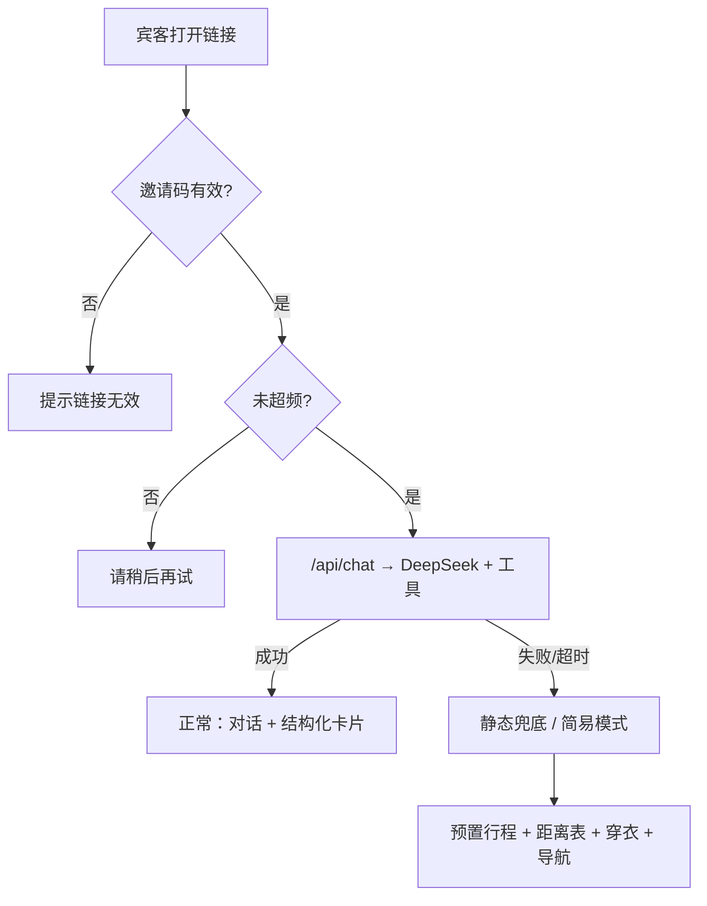

# V3 上线加固 Plan

## 背景与目标

**当前状态（截至 2026-08-08）**

| 版本 | 状态 | 能力 |
|------|------|------|
| V0 | ✅ 已上线 | Vercel 后端代理、扣子地点、高德驾车、酒店兜底 |
| V1 | ✅ 已上线 | DeepSeek 多轮对话、`get_places` / `get_route` / `get_reachable_places` |
| V2 | ✅ 已上线 | `plan_itinerary`、`get_weather`、行程卡/天气卡 |
| V2.1 | ⏳ 本地未推送 | 半日游不推苏马荡；「半日游能去苏马荡吗」明确拒答（`checkHalfDayNamedAttraction`） |

**线上地址**：https://wedding-guide-one.vercel.app/

**V3 要解决的唯一核心问题**：公开链接 + 后端持有 `DEEPSEEK_API_KEY` / `AMAP_KEY` / `COZE_PAT`，8/23 宾客集中使用时，一旦 Key 被刷、高德超限或外部 API 宕机，助手会整体不可用。

**V3 不是新功能版本**，是「上线加固」——在现有 V2 能力之上加三道门：



---

## 优先级总览

| 优先级 | 工作项 | 预估 | 理由 |
|--------|--------|------|------|
| **P0** | 邀请码 | 0.5 天 | 实现快，立刻降低 Key 被刷风险 |
| **P0.5** | 部署 V2.1 | 0.5 小时 | 半日游逻辑已修，应先上线再加固 |
| **P1** | 限流 + 输出截断 | 1 天 | 保护高德日配额；防宾客连点/长对话 |
| **P1** | 预生成距离矩阵 | 0.5 天 | 减 API 调用，兼供兜底页 |
| **P2** | 静态兜底（精简版） | 1–1.5 天 | 8/23 API 全挂时的最后防线 |
| **P2** | 备份入口 + 真机验收 | 0.5 天 | 微信内体验与 Plan B 链接 |

**若时间只够做一件**：邀请码 + `/api/chat` 服务端校验。

**若宾客 > 50 或链接会公开传播**：限流几乎必须。

**若助手是宾客主入口（非点缀）**：静态兜底建议在 **8/20 前** 完成精简版。

---

## P0：邀请码（Access Control）

### 要解决什么

- `/api/chat` 当前无任何鉴权，任何人 POST 即可消耗 DeepSeek + 高德 + 扣子。
- 邀请码不是防黑客，而是把使用者收窄到「收到婚礼链接的人」，挡掉爬虫和误刷。

### 产品设计

- 链接形态：`https://wedding-guide-one.vercel.app/?code=XY2026`
- 一场婚礼一个码即可（如 `XY2026`、`wedding0823`），不必做账号体系。
- 无码或码错误：页面可浏览地图，但 **禁用对话输入框**，提示「请使用新人分享的完整链接」。

### 技术实现清单

**环境变量（Vercel）**

```
WEDDING_INVITE_CODE=XY2026
```

**后端**

| 文件 | 改动 |
|------|------|
| 新建 `api/verify-code.js` | GET/POST 校验 code，返回 `{ valid: true/false }`（可选，也可只在 chat 里校验） |
| `api/chat.js` | 请求体增加 `invite_code` 字段；与 `process.env.WEDDING_INVITE_CODE` 比对，失败返回 403 |
| `api/driving.js` | 可选：同样校验，防止无码刷高德 |
| 新建 `api/_lib/auth.js` | 统一 `verifyInviteCode(code, env)`，供各 API 复用 |

**前端**

| 文件 | 改动 |
|------|------|
| `src/data/chatClient.js` | 从 URL `?code=` 读取并写入 localStorage；每次 `sendChatMessage` 带上 `invite_code` |
| `src/main.jsx` | 启动时校验 code；无效时禁用输入框 + 顶部 Banner 提示 |
| `.env.example` | 补充 `WEDDING_INVITE_CODE` 说明 |

### 验收标准

- [x] 无 `code` 参数时无法调用 `/api/chat`（403）
- [x] 错误 code 无法对话
- [x] 正确 code 对话正常；刷新页面 code 仍有效（localStorage）
- [x] 地图、静态点位仍可看（无码不阻断浏览）

---

## P1：限流（Rate Limiting）

### 要解决什么

邀请码挡「外人」，限流挡 **「自己人刷爆」**：同 IP 连点、超长多轮、脚本狂刷 → 高德日配额最先爆，所有人「距酒店驾车」「路程查询」全挂。

### 建议阈值（婚礼场景）

| 限制项 | 建议值 | 说明 |
|--------|--------|------|
| 每 IP / 小时 `/api/chat` | 15–30 次 | 正常宾客够用 |
| 每 IP / 小时 `/api/driving` | 60 次 | 地图点击查路程 |
| `messages` 数组长度 | ≤ 20 条 | 防 payload 膨胀 |
| 单次用户输入 | ≤ 500 字 | 防超长 prompt |
| LLM 回复 | ≤ 800 字 | 在 `formatItineraryReply` 后截断 |
| Tool 循环 | 已有 8 轮 | 保持 |

### 技术方案选型

| 方案 | 优点 | 缺点 |
|------|------|------|
| **Upstash Redis + Vercel** | 准确、跨实例共享计数 | 需注册 Upstash，多一个依赖 |
| **Vercel KV** | 与 Vercel 集成好 | 同上 |
| **内存计数（单实例）** | 零依赖 | Serverless 冷启动/多实例不准确，仅适合 demo |
| **Edge Middleware 限流** | 在进 Function 前拦截 | 需改 `middleware.js` |

**推荐**：Upstash Redis（免费档够婚礼单日用）或 Vercel KV。

### 技术实现清单

| 文件 | 改动 |
|------|------|
| 新建 `api/_lib/rateLimit.js` | `checkRateLimit({ key, limit, windowSec })`，基于 Redis INCR + TTL |
| `api/chat.js` | 取 `x-forwarded-for` 或 `x-real-ip` 作为 key 前缀；超限返回 429 + 中文提示 |
| `api/driving.js` | 同上，阈值可更高 |
| `api/_lib/deepseek.js` | 校验 `messages.length`；回复超长截断 |
| `.env.example` | `UPSTASH_REDIS_REST_URL`、`UPSTASH_REDIS_REST_TOKEN` |

### 验收标准

- [ ] 同一 IP 连续请求超过阈值返回 429，文案友好（「提问太频繁，请稍后再试」）
- [ ] 正常宾客 10 轮对话不被误伤
- [ ] 限流只作用于 API，不影响静态地图浏览

---

## P1：预生成距离矩阵（可选但强烈建议）

### 要解决什么

- 每次 `get_route` / `plan_itinerary` 都打高德，婚礼当天调用量集中。
- 矩阵预生成后：**热门路线走缓存**，既帮限流，又可直接喂给静态兜底页。

### 内容范围

以 **默认酒店** 为起点，预生成到：

- 婚宴场地、利川站、恩施站
- 腾龙洞、龙船水乡、苏马荡、鱼木寨、齐岳山等地图上的景点
- 扣子返回的热门餐厅（Top 5–10）

每条记录：`origin`、`destination`、`distance_km`、`duration_min`、`duration_text`、`mode: driving/walking`、`generated_at`。

### 技术实现清单

| 文件 | 改动 |
|------|------|
| 新建 `scripts/generate-distance-matrix.js` | 本地脚本调高德，输出 JSON |
| 新建 `public/data/distance-matrix.json` 或 `api/_lib/staticDistances.js` | 提交到仓库（婚礼前跑一遍即可） |
| `api/_lib/tools.js` | `get_route` 先查矩阵，命中则直接返回；未命中再调高德 |
| `api/_lib/planItinerary.js` | `getRoute` 注入时可复用同一缓存 |

### 验收标准

- [x] `酒店 → 利川站` 矩阵值与高德 App 手动查询误差 ≤ 2 分钟
- [x] 矩阵命中时不消耗高德配额
- [x] 脚本可重复运行更新（婚礼前 1 周再跑一遍）

---

## P2：静态兜底页（Static Fallback）

### 要解决什么

DeepSeek 宕机、高德超限、Vercel 超时、扣子全挂 → 宾客打开页面对话一直失败。

**与现有降级的区别**：

- 现有：`src/main.jsx` 扣子失败时用本地 `defaultHotel` / `attractionList` 补地图点 —— **部分 API 失败**
- V3 兜底：**整个 `/api/chat` 不可用** 时的备用体验

### 产品设计（精简版）

检测到 `/api/chat` **连续失败 2–3 次**（或超时 > 15s）→ 切换 **「简易模式」**：

页面仍显示地图（静态点），下方折叠卡片：

1. **婚礼信息**：日期、仪式/用餐时间、婚宴地址、一键导航
2. **预置距离表**：酒店→利川站、酒店→婚宴场地、酒店→腾龙洞…（来自距离矩阵）
3. **预置行程文字**：半日游（腾龙洞/龙船水乡）、两日游（D1 腾龙洞 + D2 苏马荡/鱼木寨）
4. **8 月下旬穿衣提示**：复用 V2 `climate_reference` 文案，标注「气候参考，非预报」
5. **禁用 AI 输入框**，显示「助手暂时不可用，以下为备用信息」

可选：独立路由 `/fallback.html` 作为邀请函 Plan B 链接。

### 技术实现清单

| 文件 | 改动 |
|------|------|
| 新建 `src/data/staticFallback.js` | 婚礼信息、预置行程、穿衣文案（与 `weather.js` 气候参考对齐） |
| 新建 `src/components/FallbackPanel.jsx` | 简易模式 UI |
| `src/main.jsx` | `chatErrorCount` 计数；超阈值 `setAppMode('fallback')` |
| `src/data/chatClient.js` | 超时/5xx 向上抛出，供 main 计数 |
| `public/data/distance-matrix.json` | 兜底距离表数据源（与 P1 矩阵共用） |

### 验收标准

- [x] 断网或 mock `/api/chat` 500 时，3 次失败后自动进入简易模式
- [x] 简易模式下：婚礼信息、距离表、导航链接、预置行程均可读
- [x] 恢复网络后可选「重试连接助手」按钮

---

## P2：备份入口与真机验收

### GitHub Pages Plan B

- 仓库已有 `.github/workflows/deploy-pages.yml`，子路径 `VITE_BASE=/wedding-guide/`
- **已确认可用（2026-08-11）**：https://yvette-zoe.github.io/wedding-guide/
  - `index.html` / `maps/wedding_map.json` / `data/distance-matrix.json` 均返回 200
- 纯静态站 **无 `/api/chat`**：打开后自动进入简易模式（地图 + 预置信息 + 导航）
- 邀请函文案见 [`docs/invitation-plan-b.md`](../../docs/invitation-plan-b.md)

### 真机测试清单

| 场景 | 检查点 |
|------|--------|
| iOS 微信内置浏览器 | 地图渲染、输入框、卡片滚动、高德导航跳转 |
| Android 微信 | 同上 |
| 长辈大字体模式 | 对话气泡、行程卡、按钮不溢出 |
| 弱网（3G 节流） | 加载态、超时提示、是否触发兜底 |
| 无网络 | 地图静态点 + 兜底信息是否可用 |

---

## 全量验收标准（可测，不用「体验好」）

| # | 输入/操作 | 预期 |
|---|-----------|------|
| 1 | `酒店到利川站多远多久` | 距离/时长与高德 App 误差合理（约 3.8 km / 9 分钟） |
| 2 | `帮我规划一个利川半日游` | 近郊景点，不含苏马荡 |
| 3 | `半日游能去苏马荡吗` | 明确「不行」+ 原因 + 替代建议 |
| 4 | `8月23日利川天气穿什么` | 标注「气候参考（非预报）」 |
| 5 | 无邀请码打开链接 | 不能对话（V3 P0 后） |
| 6 | 同一 IP 刷 30+ 次 chat | 返回 429（V3 P1 后） |
| 7 | 断网 / chat 全挂 | 简易模式有婚礼信息 + 距离表（V3 P2 后） |

---

## 建议实施顺序（时间线）

```
Week 1（现在）
  Day 0   推送 V2.1（半日游点名景点）到 Vercel
  Day 1   P0 邀请码：后端校验 + 前端带 code
  Day 2   P1 限流 + messages/输出截断
  Day 3   P1 距离矩阵脚本 + get_route 缓存

Week 2（8/15 前）
  Day 4–5 P2 静态兜底精简版 + FallbackPanel
  Day 6   真机验收 + 修 UI
  Day 7   确认 GitHub Pages 备份链接

8/20 前   全量验收表跑一遍；距离矩阵再生成一次
8/23      婚礼当天
```

---

## 环境变量汇总（V3 新增）

```bash
# 已有
COZE_PAT=
COZE_WF_LIST_PLACES=
AMAP_KEY=
DEEPSEEK_API_KEY=
DEEPSEEK_MODEL=deepseek-v4-flash
LICHUAN_ADCODE=422802

# V3 新增
WEDDING_INVITE_CODE=XY2026
UPSTASH_REDIS_REST_URL=          # 限流用（若选 Upstash）
UPSTASH_REDIS_REST_TOKEN=
```

---

## 不在 V3 范围（可 V4 再议）

- 扣子侧 `wf_plan_itinerary` 工作流（当前逻辑已在 Vercel `planItinerary.js`）
- 用户登录 / 手机号验证
- 后台统计看板（调用量、热门问题）
- 多婚礼 / 多邀请码（单场婚礼不需要）

---

## 相关文件索引

| 路径 | V3 可能改动 |
|------|-------------|
| `api/chat.js` | 邀请码、限流入口 |
| `api/driving.js` | 邀请码、限流 |
| `api/_lib/deepseek.js` | messages 长度、输出截断 |
| `api/_lib/tools.js` | 距离矩阵缓存 |
| `api/_lib/planItinerary.js` | 矩阵注入 getRoute |
| `src/main.jsx` | 无码禁用、兜底模式切换 |
| `src/data/chatClient.js` | invite_code、错误计数 |
| `src/data/staticFallback.js` | 新建 |
| `scripts/generate-distance-matrix.js` | 新建 |
